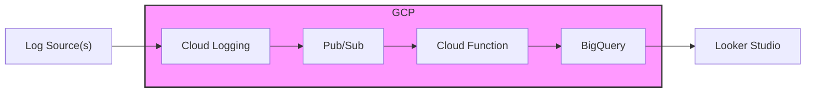

# Log Analysis MVP on GCP

## Description

This project implements a minimal viable product (MVP) for log analysis on Google Cloud Platform (GCP). It leverages GCP's managed services for fast deployment and ease of use.

## Architecture

The architecture consists of the following components:

*   **Log Source(s):**  Represents where logs are generated from (e.g., applications, servers).
*   **Cloud Logging:** Google Cloud's fully managed logging service, used to ingest and store logs.
*   **Pub/Sub:** A messaging service used to decouple log ingestion from processing.
*   **Cloud Function:** A serverless function that processes log messages from Pub/Sub.
*   **BigQuery:** A fully managed, serverless data warehouse for storing processed log data.
*   **Looker Studio:** A business intelligence and data visualization tool used to analyze and visualize the data stored in BigQuery.



## Setup

1.  **Install Docker and Docker Compose:** Ensure you have Docker and Docker Compose installed on your local machine.
2.  **Clone the Repository:** Clone this repository to your local machine.
3.  **Configure Fluentd (Optional):** Modify the `fluentd/fluent.conf` file to configure how logs are collected and forwarded to Cloud Logging. (If you need local log testing.)
4.  **Run Docker Compose:** Execute the following command in the project directory:

    ```bash
    docker-compose up -d
    ```

5.  **Deploy Cloud Function:**  Create a Cloud Function that subscribes to the Pub/Sub topic. The Cloud Function should process the log data and insert it into BigQuery.
6.  **Create BigQuery Table:** Create a BigQuery table with the appropriate schema to store the processed log data.
7.  **Connect Looker Studio to BigQuery:** Connect Looker Studio to your BigQuery table and create visualizations to analyze the log data.
